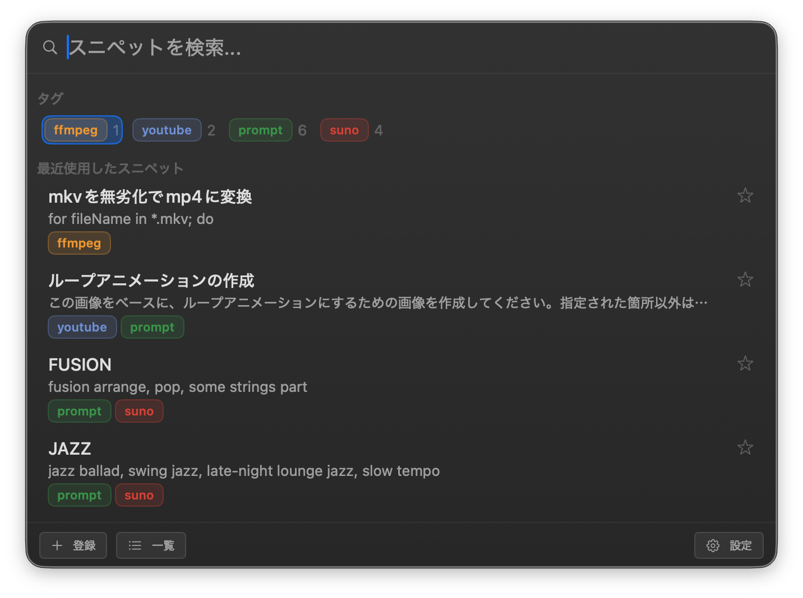

# PopSnip

PopSnip is a lightweight macOS menu bar app for storing text snippets and inserting them into any app with a global keyboard shortcut — a fast, Spotlight-style search panel for your everyday boilerplate text.



## Features

- **Global shortcut search panel** — press a shortcut (default `⌥⌘Space`) anywhere to open a search box near your cursor
- **Fast search** — searches titles, bodies, and tag names as you type; matching tags remain available as filter suggestions
- **Compact tag browsing** — colored tag chips stay in a single horizontally scrollable row by default, with an optional one-tag-per-row layout
- **One-key insertion** — the focused snippet is inserted directly into whatever text field you were using, via the Accessibility API with an automatic clipboard fallback
- **Keyboard-first** — arrow keys to move, Tab / Shift+Tab to cycle tags, Enter to select, `⌘1`–`⌘9` to pick a snippet directly, Backspace to back out of a tag, Esc to dismiss
- **Right-click to edit or delete** any snippet straight from the search panel
- **Resizable panel** that remembers the size you last left it at
- **Snippet list window** for browsing everything at once, bulk tag editing, and tag management (rename, recolor, delete)
- **Adjustable font size** (Small / Medium / Large) for the panel and list
- **Native macOS settings window** with a sidebar for General, Panel, Shortcut, Permission, and Update
- **Automatic update checks** via Sparkle

## Requirements

- macOS 14.0 or later
- Accessibility permission, so PopSnip can insert text into the focused field of other apps

## Building from Source

PopSnip's Xcode project is generated with [XcodeGen](https://github.com/yonaskolb/XcodeGen) from `project.yml`.

```bash
brew install xcodegen
xcodegen generate
open PopSnip.xcodeproj
```

Build and run the `PopSnip` scheme in Xcode (`⌘R`).

## Getting Started

1. Launch PopSnip. It runs as a menu bar icon only — there's no Dock icon or window at first.
2. Grant Accessibility permission when prompted, or from **Settings → Permission**.
3. Press `⌥⌘Space` (or your custom shortcut) to open the search panel.
4. Type to search, or leave the box empty to browse by tag or recently used snippets.
5. Press Enter, or click a result, to insert it into the field you were typing in.
6. Click **Register** to create a new snippet. If you had text selected in another app, it's pre-filled into the body.
7. Right-click any snippet in the panel to edit or delete it.

## Usage

### Search Panel

- Open/close with your configured shortcut (default `⌥⌘Space`). The panel appears near your mouse cursor by default (configurable to screen center).
- Type to search across snippet titles, bodies, and tag names. Matching tag suggestions remain above the snippet results; selecting one clears the query and starts a tag drill-down.
- `↑` / `↓` to move the selection, `Enter` to insert, `Esc` to dismiss.
- When a tag is selected, use `Tab` / `Shift+Tab` or `←` / `→` to cycle through the visible tags. The selection wraps at either end.
- `⌘1`–`⌘9` inserts a snippet directly by its position in the snippet results; tag suggestions are not counted (toggle in **Settings → Panel**).
- With the search box empty, `Backspace` steps back one level out of a tag drill-down.
- Right-click a snippet for **Edit** / **Delete**.
- Drag any edge of the panel to resize it — PopSnip remembers your preferred size.
- **Register**, **List**, and **Settings** buttons sit at the bottom of the panel.

### Tags

- A snippet can have multiple tags, shown as colored rounded chips.
- New tags get an automatically assigned color; click the color circle in the tag manager to pick a different one from the palette.
- Tags appear in a single horizontally scrollable row by default. The selected tag scrolls into view automatically; choose the one-tag-per-row layout in **Settings → Panel** if preferred.
- Tag order can be set to registration order, most matches first, or recently used in **Settings → Panel**. Recently used is based on the latest use of a snippet carrying each tag; during a drill-down, it is calculated only from snippets in the current tag scope.
- Click or press Enter on a tag to drill into snippets that have it. Search within a drill-down is limited to the currently selected tag scope, and additional matching tags can be selected to narrow it further.
- Add or create tags while editing a snippet, or manage all tags — rename, recolor, delete, or add new ones — from the sidebar of the snippet list window.

### Snippet List Window

Open it from the panel's **List** button or the menu bar.

- Browse and filter every snippet in a table.
- Select multiple rows and use the **Tags** button to bulk add/remove tags by clicking tag chips.
- Double-click a row, or right-click → **Edit**, to open the editor.
- Delete selected snippets in bulk.

### Settings

Open from the panel's **Settings** button or **PopSnip Settings...** in the menu bar. A sidebar switches between:

- **General** — launch at login, insertion method (Automatic / Accessibility only / Clipboard only), clipboard restore delay, font size, and the snippet storage location.
- **Panel** — which sections appear and in what order, item counts, search and tag sort order, tag layout, panel position, Enter key behavior, number-key selection, and tag color display.
- **Shortcut** — customize the global shortcut for each action.
- **Permission** — check and grant Accessibility access.
- **Update** — check for updates now, toggle automatic checks, and see the current version.

### Menu Bar

Click the menu bar icon for quick access to:

- Show Snippet Panel...
- Open Snippet List...
- Check for Updates...
- PopSnip Settings...
- About PopSnip...
- Quit

## Data Storage

Snippets and tags are stored as JSON at `~/Library/Application Support/PopSnip/snippets.json` (the path is configurable in **Settings → General**). If you edit the file externally, PopSnip picks up the changes the next time the panel opens.

## Updates

PopSnip checks for updates automatically via [Sparkle](https://sparkle-project.org). You can also trigger a check manually from the menu bar or **Settings → Update**.
